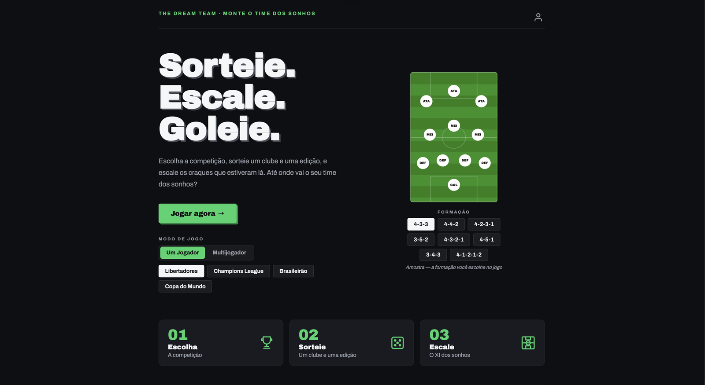
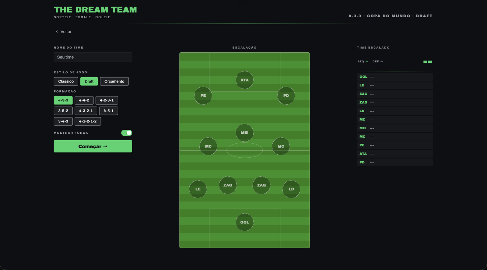
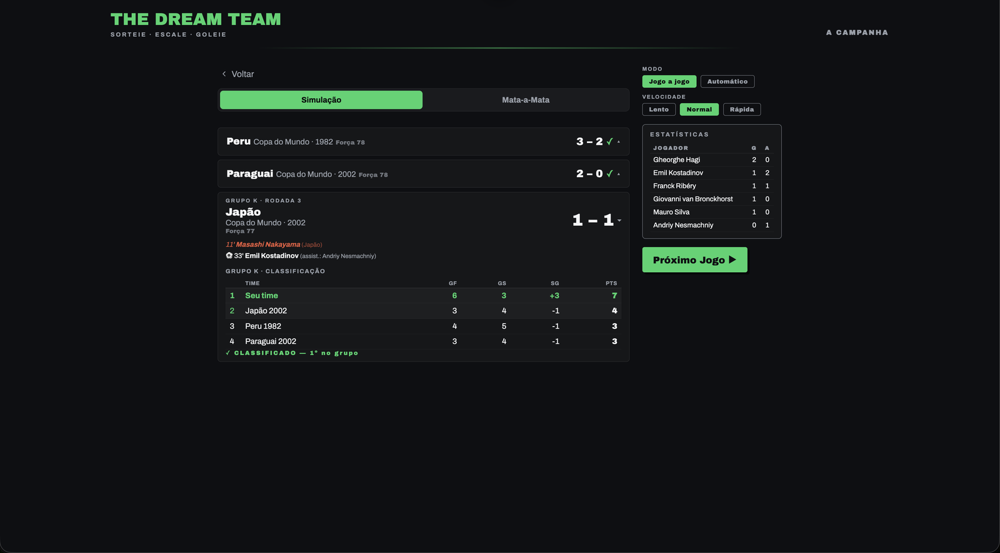
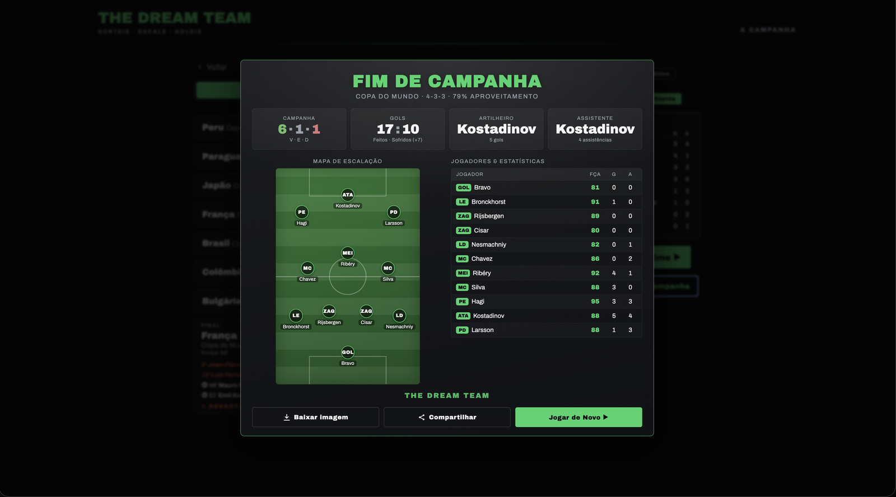
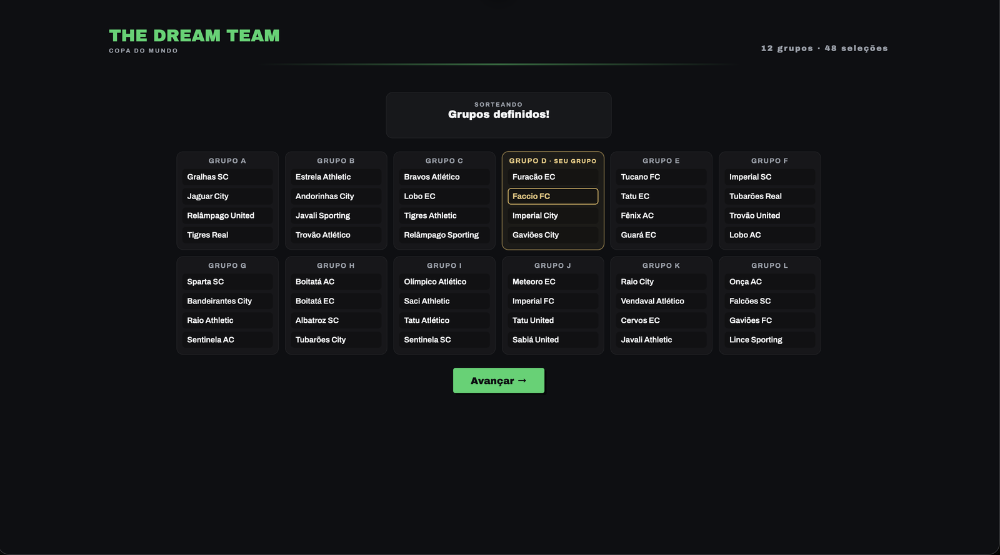
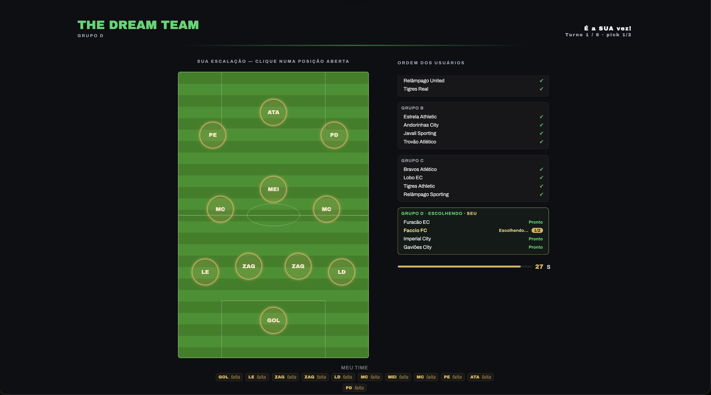
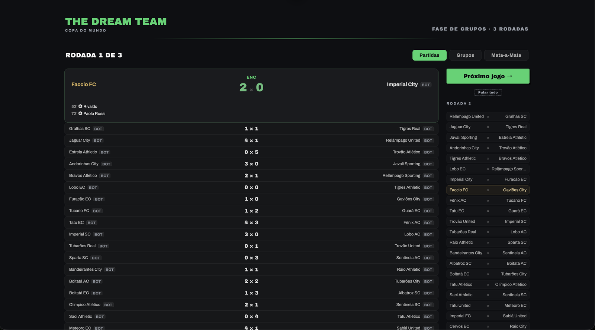
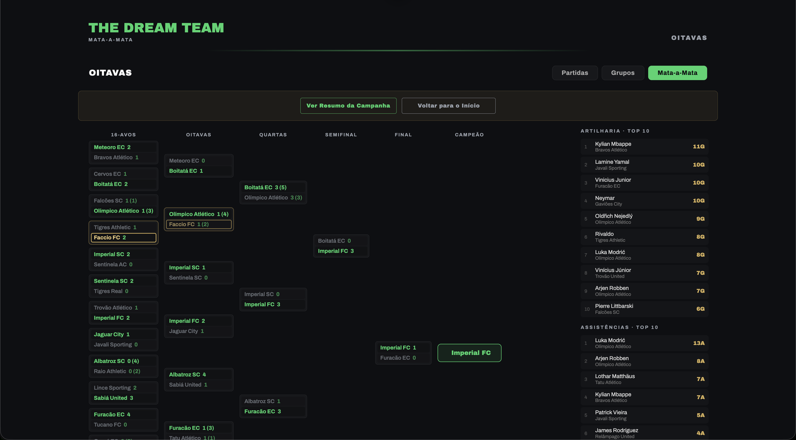

<div align="center">

# The Dream Team

Monte o time dos sonhos com craques da Libertadores, da Champions League, do Brasileirão e da Copa do Mundo e leve-o ao título — sozinho ou contra outros jogadores online.


</div>

---

## Sobre o projeto

The Dream Team é um jogo de futebol de navegador. Você sorteia clubes lendários, monta uma escalação misturando craques de diferentes times e épocas e conduz uma campanha completa até o título — mata-mata com fase de grupos e pênaltis nas competições "de copa" (Libertadores, Champions e Copa do Mundo), ou pontos corridos (20 times, 38 rodadas) no Brasileirão. No modo online, a Copa do Mundo também é disputada em **grupos + mata-mata** entre os jogadores da sala.

O jogo tem dois grandes modos:

- **Um jogador (offline):** roda inteiramente no navegador, sem instalação e sem servidor — HTML, CSS e JavaScript puro, sem frameworks nem etapa de build.
- **Online (multiplayer):** salas em tempo real onde vários jogadores fazem um **draft** disputado e jogam um campeonato juntos — **liga de pontos corridos** (Brasileirão), **grupos + mata-mata** (Libertadores e Copa do Mundo) ou a **fase de liga fiel** da Champions League. Esse modo usa um backend leve (Node + Socket.IO + PostgreSQL).

A base de dados reúne elencos reais de cada temporada da Copa Libertadores (1960 a 2025), da UEFA Champions League (1956 a 2025), do Campeonato Brasileiro (1959 a 2025) e da Copa do Mundo (1930 a 2026). São **1.521 elencos** e mais de **23 mil jogadores**, com a força de cada atleta calibrada individualmente. Os elencos históricos mais antigos refletem o plantel registrado da época e podem ter menos de 16 nomes.

## Demonstração

As capturas de tela ficam em `assets/imagens/screenshots/`.

**Um jogador**

<div align="center">

| Tela inicial | Escalação |
|:---:|:---:|
|  |  |

| Simulação | Resumo da campanha |
|:---:|:---:|
|  |  |

</div>

**Online — Copa do Mundo** (grupos + mata-mata)

<div align="center">

| Sorteio dos grupos | Draft por grupo |
|:---:|:---:|
|  |  |

| Fase de grupos | Mata-mata |
|:---:|:---:|
|  |  |

</div>

## Funcionalidades

### Modo um jogador (offline)

- **Sorteio de clubes e seleções** lendários da Libertadores, da Champions, do Brasileirão e da Copa do Mundo, por edição.
- **Outro sorteio**, que re-sorteia qualquer clube ou ano da competição, com orçamento de skips por partida.
- **Estilos de jogo**: Clássico (sorteio de clubes) e Draft, em que você monta o XI escolhendo entre cartas aleatórias por posição, com raridade por força e re-sorteios limitados — sem jogadores repetidos. Há ainda o **Orçamento** (em um jogador): cada jogador tem um preço conforme a força e você monta o time sem estourar um teto — poucos craques caros ou muitos medianos, a escolha é sua.
- **Escalação livre**: alocar, mover e trocar jogadores no campo, com a lista indicando quem pode ocupar cada posição.
- **Oito formações**: 4-3-3, 4-4-2, 4-2-3-1, 3-5-2, 4-3-2-1, 4-5-1, 3-4-3 e 4-1-2-1-2.
- **Campanha completa** na Libertadores, na Champions e na Copa do Mundo, com fase de grupos e classificação seguidas de mata-mata até a final, e uma aba **Mata-a-Mata** que desenha a chave inteira (com seu time em destaque e os pênaltis quando há empate).
- **Modo Brasileirão (liga)**: pontos corridos com 20 times e 38 rodadas, **Tabela** completa (P, J, V, E, D, GF, GS e SG) atualizada a cada rodada e botão **Pular tudo** para simular o restante da temporada de uma vez.
- **Disputa de pênaltis** quando o mata-mata termina empatado.
- **Simulação jogo a jogo ou automática**, em três velocidades.
- **Estatísticas por jogador** (gols e assistências) atualizadas ao vivo.
- **Resumo da campanha** ao final, com opção de baixar como imagem e compartilhar.

### Modo online (multiplayer)

- **Contas e convidados**: jogue com login (e-mail/senha) ou entre como **convidado**, sem cadastro.
- **Salas em tempo real**: crie uma sala (recebe um código) ou entre em uma existente; o **host** comanda o início e o avanço das partidas.
- **Formatos**, escolhidos pela competição da sala:
  - **Brasileirão (liga)**: 20 times, pontos corridos, 38 rodadas, todos contra todos (ida e volta).
  - **Libertadores (grupos + mata-mata)**: 32 participantes em 8 grupos de 4, fase de grupos e depois a chave eliminatória até a final.
  - **Copa do Mundo (grupos + mata-mata)**: 48 participantes em 12 grupos de 4, fase de grupos e depois a chave eliminatória até a final.
  - **Champions League (fase de liga fiel 25/26)**: 36 participantes numa tabela única, 8 rodadas; top 8 às oitavas, 9º–24º ao playoff e 25º–36º eliminados.
- **Vagas completadas por bots**: as que sobram são preenchidas por bots com nomes próprios (únicos na sala), que montam seus elencos sozinhos.
- **Draft por posição**: na sua vez, você **clica numa posição aberta** do campo e vê os **melhores jogadores disponíveis** para ela (considerando **todas as posições** que cada atleta pode jogar — um ATA que também atua de MEI aparece para uma vaga de MEI), e então escolhe quem entra. Você também pode remanejar quem já colocou.
  - No **Brasileirão** e na **Champions**, o draft é **snake** (a ordem espelha a cada rodada) e ninguém pega o mesmo nome duas vezes. São **6 turnos** (2 picks por turno, 1 só no último = 11 jogadores).
  - Na **Libertadores** e na **Copa**, o draft acontece **por grupo, rodada a rodada** (todos os grupos escolhem em paralelo, com um ritmo cadenciado), também em **6 turnos de 2 picks** (1 de cada vez); jogadores podem repetir entre usuários diferentes, mas nunca para você mesmo.
- **Sorteio dos grupos** (Copa): uma animação distribui os 48 participantes nos grupos A–L, com **o seu grupo destacado em dourado**.
- **Fase de grupos** (Copa): cada grupo joga turno único (3 rodadas); a aba **Grupos** mostra as **12 tabelas** simultâneas, com os 2 primeiros em verde e o seu time em dourado. Classificam-se os **2 primeiros de cada grupo + os 8 melhores terceiros** (por pontos, saldo e gols).
- **Mata-mata** (Copa): a aba **Mata-a-Mata** desenha a chave inteira (16-avos → final), com placares, vencedores destacados, **pênaltis** nos empates e o **campeão** coroado ao fim. O host avança fase por fase.
- **Simulação animada da sua partida** (liga): placar e relógio correndo ao vivo, com os gols (e quem marcou/assistiu) surgindo no minuto certo — clique para pular.
- **Tela em abas**: *Partidas* (seu jogo + os demais resultados e próximos confrontos), *Classificação/Grupos* (tabela do Brasileirão **ou** as tabelas dos grupos da Copa, sempre com artilharia e assistências) e, na Copa, *Mata-a-Mata* (a chave).
- **Pular tudo (votação)**: no Brasileirão, qualquer jogador pode propor pular o restante da temporada; só acontece quando **todos os humanos** confirmam, com contador de votos.
- **Premiação**: ao fim, abre um resumo com **O Campeão**, **O Pato**, **O Goleador** (mais gols) e **O Peneira** (mais gols sofridos), seguido do **resumo da sua campanha** (escalação, estatísticas e imagem para baixar).

### Geral

- **Perfil do jogador**: clicar no ícone de perfil abre a sua tela (ou o login, se você for convidado). Reúne suas **estatísticas** por competição em seções expansíveis (campanhas, títulos, vitórias, gols e aproveitamento), um mapa do seu **time mais escalado** (com seletor por competição), o **histórico** de campanhas e as **conquistas**.
- **Conquistas**: 76 troféus que desbloqueiam conforme você joga, cada um com uma **raridade** (comum, raro, épico ou lendário) — de progressão (primeira vitória, veterano, dinástico) a feitos de placar (7 a 0, hat-trick, pôquer, massacre, show de bola, vencer uma final nos pênaltis) e títulos por competição. Ao desbloquear, um **aviso no canto** anuncia o troféu (estilo Steam). O cálculo é feito e persistido no servidor.
- **Quatro temas** que acompanham a competição escolhida.
- **Layout responsivo** para celular e tablet — inclusive em todas as telas do modo online (sorteio, draft por grupos, elencos e mata-mata).

## Como jogar

### Offline

1. Escolha a competição (Libertadores, Champions, Brasileirão ou Copa do Mundo) e uma formação de amostra na tela inicial.
2. Clique em **Jogar agora**.
3. Escolha o **estilo de jogo**: Clássico ou Draft. Após rolar ou começar, o estilo e a formação ficam travados.
4. No **Clássico**: sorteie um clube (use **Outro sorteio** para trocar) e monte seu XI selecionando um jogador da lista e uma vaga compatível no campo. É possível misturar clubes.
5. No **Draft**: escolha a formação e clique em **Começar**. Clique em cada vaga do campo para abrir cartas aleatórias e selecione o jogador desejado; você tem re-sorteios limitados por draft.
6. Com o time completo, clique em **Simular**.
7. Na Libertadores, na Champions e na Copa do Mundo, avance pela fase de grupos e pelo mata-mata e vença a final; a aba **Mata-a-Mata** mostra a chave completa.
8. No **Brasileirão**, dispute as 38 rodadas acompanhando a tabela; use **Pular tudo** para ir direto ao resultado final. Ser **1º colocado** é o título.
9. Ao final, abra o resumo da campanha.

### Online

1. Na tela inicial, entre no **modo online** (faça login ou entre como convidado).
2. **Crie uma sala** (escolhendo a competição e compartilhando o código) ou **entre** com o código de uma sala existente.
3. No **lobby**, defina o nome do time e a formação e marque **Pronto**. As vagas que faltarem viram bots.

**Se a sala for de Brasileirão (liga):**

4. O **host** inicia o **draft snake**. Na sua vez, **clique numa posição aberta**, escolha um dos jogadores disponíveis e confirme; remaneje o time como quiser.
5. Começa o campeonato de 38 rodadas. A cada rodada, assista à **animação da sua partida** e acompanhe a aba **Classificação**. O host avança as rodadas (ou propõe **Pular tudo**, por votação).
6. Ao fim, a **premiação** abre sobre a classificação; depois você vê o **resumo da campanha** ou volta ao início.

**Se a sala for de Copa do Mundo (grupos + mata-mata):**

4. Acontece o **sorteio dos grupos** (seu grupo fica destacado).
5. Vem o **draft por grupo, rodada a rodada**: na sua vez, clique numa vaga e escolha entre as cartas da posição.
6. Joga-se a **fase de grupos** (3 rodadas); acompanhe as 12 tabelas na aba **Grupos**. Classificam-se os 2 primeiros de cada grupo + os 8 melhores terceiros.
7. Começa o **mata-mata**: o host avança fase por fase e a aba **Mata-a-Mata** mostra a chave evoluindo até o **campeão**, com pênaltis nos empates.
8. Ao fim, a **premiação** e o **resumo da campanha**.

## Arquitetura e deploy

O projeto é dividido em duas partes que são publicadas separadamente:

| Parte | O que é | Onde roda |
|---|---|---|
| **Frontend** (`index.html`, `css/`, `js/`) | O jogo em si (offline + cliente do modo online) | **GitHub Pages** |
| **Backend** (`api/`) | API REST + servidor Socket.IO (salas, draft, simulação online, contas, ranking) | **Render** (Docker) |
| **Banco de dados** | PostgreSQL (usuários, salas, partidas, ranking) | **Supabase** |

O frontend é estático: qualquer push na branch publicada atualiza o GitHub Pages quase imediatamente. O backend é um container Docker (`api/Dockerfile`) que o Render reconstrói a cada push (veja a observação sobre deploy mais abaixo). O cliente descobre a URL do backend em `js/api.js`.

## Estrutura de pastas

```text
TheDreamTeam/
├── index.html
├── CNAME
├── README.md   CONTRATOS.md   ESTADO.md   RECURSOS.md   SEGURANCA.md   LICENSE
├── DESIGN-SYSTEM.md   PLANO-CONQUISTAS.md
├── .gitignore   privacidade.html
├── docker-compose.yml   .env.example   .dockerignore
├── assets/imagens/
├── css/
│   ├── base.css   home.css   escalacao.css   draft.css   simulacao.css
│   ├── resumo.css   auth.css   perfil.css   online.css
│   ├── campo.css   penaltis.css   responsivo.css
├── js/
│   ├── ui.js   penaltis.js
│   ├── dados/   libs/
│   ├── estado.js   formacoes.js   regras.js   interface.js
│   ├── sorteio.js   escalacao.js   draft.js   simulacao.js
│   ├── campanha.js   brasileirao.js   resumo.js   home.js
│   ├── api.js   auth.js   perfil.js   conquistas.js   online.js
│   └── main.js
├── api/
│   ├── server.js   db.js   migrate.js   seed.js   achievements.js
│   ├── routes/   middleware/auth.js
│   ├── socket/             # index.js, salaState.js, simulacao.js
│   ├── dados/              # loader.js + elencos do servidor
│   └── Dockerfile   package.json
├── db/                     # init.sql + migrations/
└── nginx/nginx.conf
```

O **backend** é Node + Express + Socket.IO sobre PostgreSQL; o `socket/` concentra a lógica online (liga, grupos/mata-mata e a fase de liga da Champions).

## Rodando localmente

O modo um jogador não precisa de nada: basta abrir o `index.html` no navegador (ou servir a pasta com qualquer servidor estático).

Para subir o backend do modo online localmente, há um `docker-compose.yml` (API + PostgreSQL). Copie o `.env.example` para `.env`, ajuste as variáveis e rode:

```bash
docker compose up --build
```

A API expõe rotas em `/auth`, `/me`, `/rooms`, `/matches`, `/ranking`, `/health` e o canal `/socket.io`. Aponte o `BACKEND_URL` em `js/api.js` para o endereço local se quiser testar o online contra o seu próprio servidor.

## Tecnologias

- **HTML5 / CSS3 / JavaScript (vanilla)** — todo o jogo no cliente, sem frameworks nem build.
- **html2canvas** (via CDN) — exporta o resumo da campanha como imagem.
- **Node.js + Express** — API REST do backend.
- **Socket.IO** — comunicação em tempo real das salas (draft, liga e grupos/mata-mata).
- **PostgreSQL** — persistência (usuários, salas, partidas, ranking).
- **JWT** — autenticação (incluindo tokens de convidado).
- **Docker** — empacotamento do backend.
- **GitHub Pages / Render / Supabase** — hospedagem do frontend, do backend e do banco.

## Licença

Distribuído sob a licença MIT. Consulte o arquivo [`LICENSE`](LICENSE) para mais detalhes.
